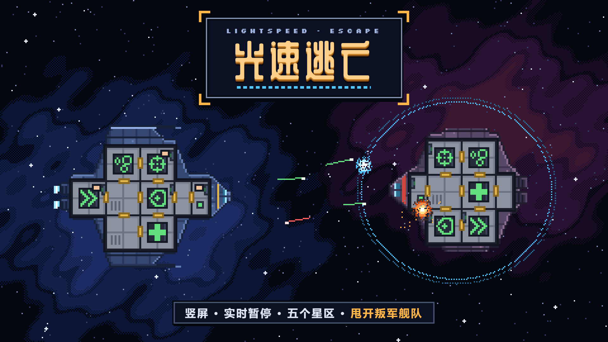
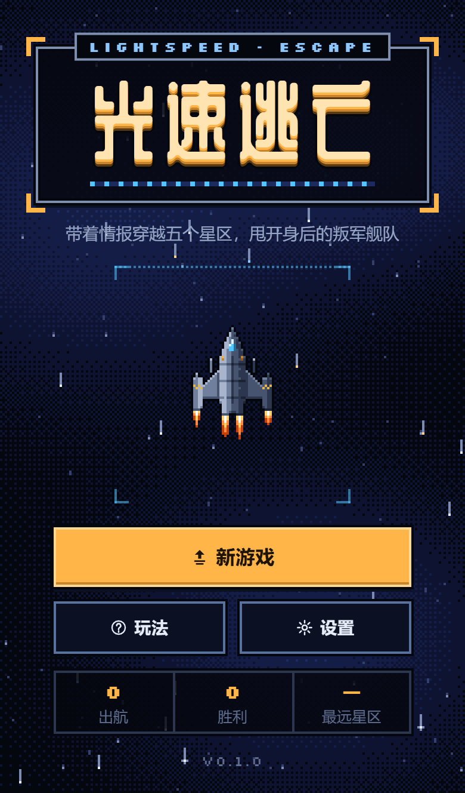
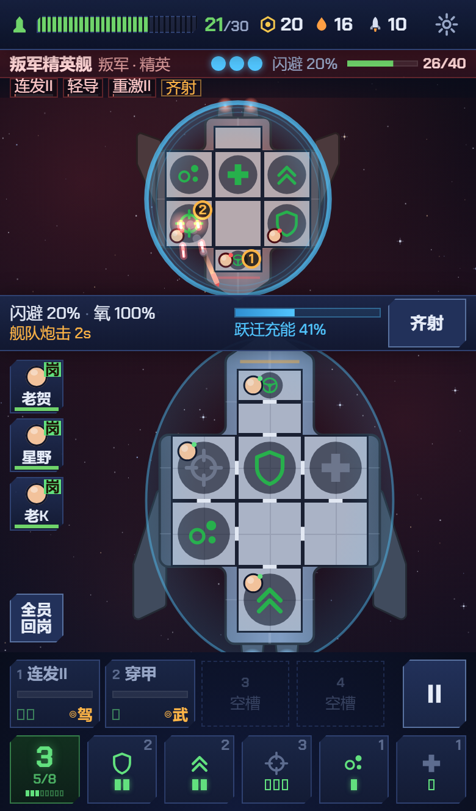
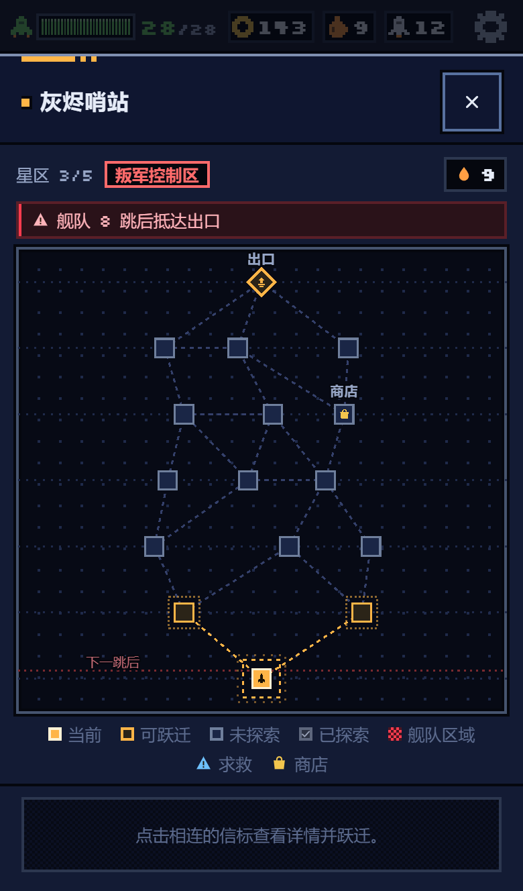

<div align="center">
  
</div>

# 光速逃亡 · Lightspeed Escape

一款**竖屏、单手可玩、触摸优先**的太空生存 Roguelike——向 *FTL: Faster Than Light* 致敬的轻量原创作品。
带着情报穿越 5 个星区，躲开身后一寸寸逼近的叛军舰队，最终击毁叛军旗舰。一局 20–30 分钟。

零运行时依赖、无打包器、无 `npm install`。整个游戏是 37 个 JS 文件构成的 IIFE 集合，挂在一个全局命名空间 `G` 上。

<div align="center">
  
  &nbsp;
  
  &nbsp;
  
</div>

---

## 立刻开玩

**方式一：在线直接玩（推荐）**

> ### ▶ [https://1gp-studio.github.io/LightspeedEscape/](https://1gp-studio.github.io/LightspeedEscape/)

手机浏览器打开即可，竖屏单手玩。每次 `main` 分支推送后由 GitHub Actions 自动重新构建并发布。

**方式二：本地单文件**

```
dist/lightspeed.html
```

单文件、自包含，双击即可在任何手机/桌面浏览器中运行（离线可用，唯一的外部请求是 Google Fonts）。

**方式三：本地开发服务器**

```bash
node serve.mjs          # http://localhost:5173
PORT=8080 node serve.mjs
```

**方式四：重新构建产物**

```bash
node build.mjs          # 读取 index.html 的 <script>/<link> 顺序，产出 dist/*.html
```

---

## 玩法

- **选船与难度**：游隼号 / 雷鸣号，简单 / 普通 / 困难。
- **跃迁**：信标地图是一张无向图，可以任意跳向相邻信标（也允许往回跳）。每次跃迁消耗 1 燃料；重复造访是安全的，商店也不会关门。
- **叛军舰队**：每次跃迁后从起点行向上推进一格，被覆盖的信标变得危险（精英敌舰 + 舰队炮击）。界面上的「叛军舰队约 N 跳」就是倒计时。
- **信标**：文本事件（部分选项由船员种族 / 武器 / 系统解锁，显示为蓝色）、敌舰遭遇、商店、求救信号、空信标。星云星区会遮蔽商店与求救图标，直到你亲自抵达。
- **战斗**：**实时进行，但随时可以暂停**，暂停中同样能下达全部指令。
  - 分配反应堆电力（护盾 / 引擎 / 氧气 / 医疗舱 / 武器）
  - 瞄准敌舰**具体舱室**，分配船员驻守岗位、灭火、修补破口、抢修系统
  - 用 FTL 充能逃跑——旗舰除外，它不接受你跑掉
- **养成**：用废料升级系统、购买反应堆格数、武器、增强模块（最多 3 个）、船员、燃料、导弹与船体维修。
- **结束**：击毁旗舰即胜利；船体归零或全员阵亡即失败。

### 操作

| 操作 | 手势 |
| --- | --- |
| 选中武器 | 点武器卡（自动通电；失败会在状态条说明原因），再点一次取消 |
| 指定目标 | 按住敌舰区域拖动，松手即确认；也可点快捷图标直接锁定某系统 |
| 指挥船员 | 先点船员格或点自己船上的舱室循环选中，再点目标舱室 |
| 调整电力 | 点系统芯片 +1，状态条里点 −1；芯片上竖滑 ≥14px 快速 ±1 |
| 暂停 | 点暂停键；桌面端空格键 |

全部交互只用 Pointer Events，**没有任何长按**，触摸目标 ≥ 44px（紧凑模式 ≥ 40px）。

---

## 项目结构

```
index.html                  开发入口；其 <script>/<link> 顺序即是构建清单
build.mjs                   构建 dist/lightspeed.html 与 dist/artifact.html
serve.mjs                   零依赖静态服务器
SPEC.md                     规格说明书（唯一事实来源）

src/core/                   ns / rng / util            —— 基础设施
src/data/                   rules / systems / weapons / crew / ships / enemies /
                            sectors / events / text    —— 全部数值与文案
src/sim/                    ship / crew / enemies / ai / combat / map / events /
                            store / run / save         —— 纯逻辑，可在 node 中运行
src/ui/                     dom / input / render / view / audio / screens/*
src/main.js                 应用胶水：定步长主循环、界面路由、自动存档

tests/                      node:test 单元测试 + tests/bot.mjs 无头自动对局
tools/                      开发辅助页（截图、封面合成），不参与构建
assets/                     封面、横幅、截图
dist/                       构建产物（已提交，可直接分发）
```

---

## 开发

```bash
node --test tests/*.test.mjs          # 121 项单元测试
node tests/bot.mjs --runs 200         # 无头机器人大批量跑图，输出胜率 / 到达星区 / 局长
node serve.mjs                        # 本地预览
```

### 架构约束（详见 `SPEC.md`）

- **零依赖 / 无打包器**：每个源文件是一个 IIFE，向 `G` 挂载。语言级别 ES2017，不使用 `?.` / `??` 等 ES2020+ 语法。
- **分层纯净**：`src/core`、`src/data`、`src/sim` 不得触碰 `window` / `document` / `localStorage` / `Math.random` / `Date`，因此它们可以在 node 的 `vm` 上下文里直接跑测试。DOM、canvas、WebAudio 只存在于 `src/ui` 与 `src/main.js`。
- **可确定重放**：所有随机数走 `G.RNG` + `run.rng`；整个 run（包括战斗中途）都可以 JSON 序列化并原样续跑。相同种子 + 相同操作 = 相同结果。
- **纯净查询**：`can*` / `*State` / `*Info` / `preview*` 一类的函数绝不掷骰、绝不改状态。
- **移动端优先**：固定 1/30s 物理步长，canvas DPR 上限 2，目标中端手机 60fps；支持 360×560 / 360×640 / 390×664 / 390×763 / 430×932 等真实视口，宽屏折叠为居中 480px 列。
- **界面文案全中文**，数字与拉丁字母使用 Chakra Petch，标题使用 ZCOOL 青科黄油体。

### 开发辅助页

`tools/` 下两个页面需要经 `node serve.mjs` 访问：

```
http://localhost:5173/tools/screenshot.html?scene=combat   # 定种开局并定格一帧，用于截图
http://localhost:5173/tools/cover.html                     # 把标题字型合成到插图上，用于产出封面
```

---

## 版权与致谢

- 本作是 *FTL: Faster Than Light* 的**致敬作品**，与 Subset Games 无任何关联，也未使用其任何文本、名称或美术素材。所有飞船名、种族、事件文案与图像均为原创。
- 代码与美术版权归本项目作者所有。
